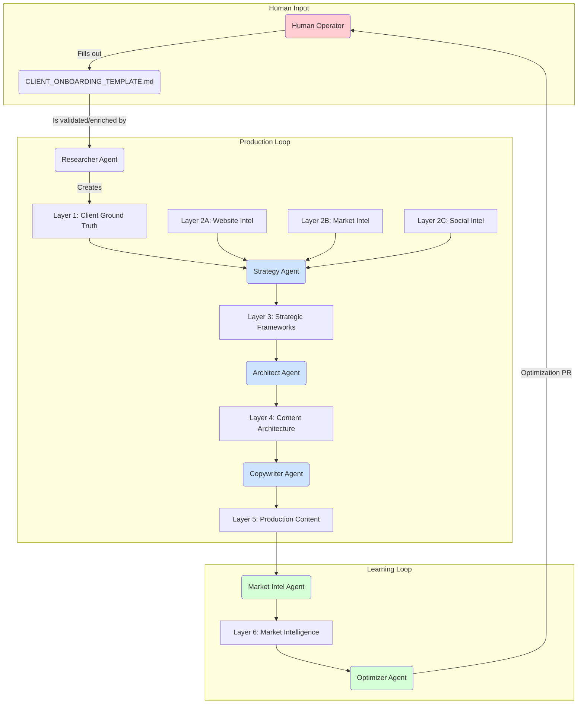

# Knowledge Base (KB) Architecture

**Architectural Note:** The Knowledge Base is the central, layered data repository for the Agentic Marketing System. It is the single source of truth. All agents communicate asynchronously by reading from and writing to the KB, with every write operation being gated by the Validator Agent. For every authoritative `.json` file, a human-readable `.md` version is also generated by the Orchestrator.

---

## KB Layer Architecture

The KB is organized into distinct, numbered layers. Each layer represents a specific stage of the intelligence and content generation lifecycle.

| Layer ID | Directory Name                    | Owning Agent    | Data Description                                      | Consumed By      |
|----------|-----------------------------------|-----------------|-------------------------------------------------------|------------------|
| **1**    | `layer1_client_ground_truth/`       | `Researcher`    | Hybrid "Ground Truth" combining human-led discovery (`CLIENT_ONBOARDING_TEMPLATE.md`) and automated validation/enrichment. | `Strategy Agent` |
| **2A**   | `layer2A_website_intelligence/`     | `Researcher`    | Objective analysis of competitor websites.              | `Strategy Agent` |
| **2B**   | `layer2B_market_intelligence/`      | `Researcher`    | Third-party market analysis and sentiment.            | `Strategy Agent` |
| **2C**   | `layer2C_social_intelligence/`      | `Researcher`    | Competitor social media analysis.                     | `Strategy Agent` |
| **3**    | `layer3_strategic_frameworks/`      | `Strategy`      | Synthesized strategic insights and positioning.       | `Architect Agent`|
| **4**    | `layer4_content_architecture/`    | `Architect`     | Codified "brand bible" with voice and pillars.        | `Copywriter Agent`|
| **5**    | `layer5_production_content/`      | `Copywriter`    | Final, generated content assets.                      | `Market Intel`   |
| **6**    | `layer6_market_intelligence/`     | `Market Intel`  | Real-world performance data of published assets.      | `Optimizer Agent`|

---

## Data Flow Diagram

This diagram illustrates the flow of data through the Production and Learning Loops of the system.

